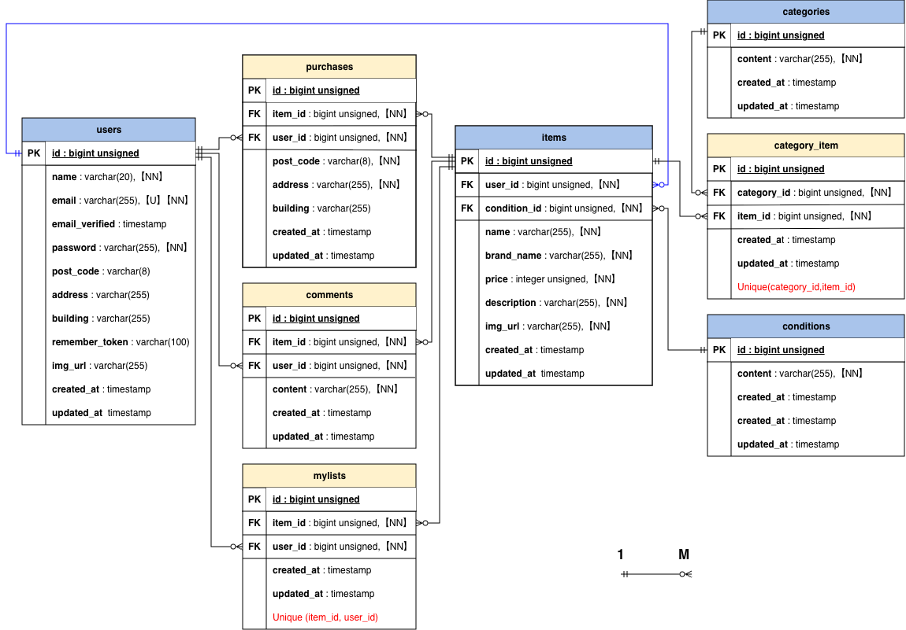

# COACHTECHフリマアプリ

## 概要

本アプリは、ユーザーが商品の閲覧・出品・購入ができるフリマアプリです。

- 会員登録/ログイン済みユーザー：商品の閲覧・出品・購入が可能です。
- 未ログインユーザー：商品の閲覧が可能です。
- **GitHub URL:** https://github.com/kana686/fleamarket-app-retry.git

## 目次

- [実装機能一覧](#実装機能一覧)
- [ER図](#er図)
- [環境構築手順](#環境構築手順)
- [プロジェクト設定](#プロジェクト設定)
- [使用技術](#使用技術)

### 実装機能一覧

- 会員登録画面
    - 新規会員登録機能
    - 会員登録後にプロフィール設定画面への遷移
    - ログイン画面への遷移
    - メール認証画面への遷移(応用)
- メール認証画面(応用)
    - 新規会員登録時のメール認証機能
    - メール認証再送機能
- ログイン画面
    - ログイン機能
    - 商品一覧画面への遷移
- ログアウト
    - セッション破棄・ログアウト機能
- 商品一覧画面
    - 商品一覧取得機能
    - マイリスト一覧取得機能
    - 商品検索機能
- 商品詳細画面
    - 商品詳細取得機能
    - いいね機能
    - コメント送信機能
    - 購入画面への遷移
- 商品購入画面
    - 購入前商品情報取得機能
    - 商品購入機能
    - 支払い方法選択機能
    - 配送先変更機能
- プロフィール画面
    - ユーザー情報取得機能
    - プロフィール編集画面への遷移
- プロフィール編集画面
    - ユーザー情報変更機能
- 商品出品画面
    - 出品商品情報登録機能
    - 出品商品画像アップロード機能

## ER図



## 環境構築手順

1.  プロジェクトディレクトリの作成とリポジトリをクローン
    プロジェクト用のディレクトリを作成し、移動してからクローンします。

    ```bash
    mkdir -p [任意のディレクトリ名]
    cd [任意のディレクトリ名]
    git clone https://github.com/kana686/fleamarket-app-retry.git .
    ```

2.  環境変数の設定
    `.env.example`をコピーして`.env`を作成します。

    ```bash
    cp .env.example .env
    ```

    ※ 必要に応じて .env 内のデータベース設定が以下と一致しているか確認してください。

    ```bash
    DB_CONNECTION=mysql
    DB_HOST=mysql
    DB_PORT=3306
    DB_DATABASE=laravel
    DB_USERNAME=sail
    DB_PASSWORD=password
    ```

    また、Stripeを使用する場合は、`.env`に以下の項目を追加してください。

    ```
    STRIPE_KEY=pk_test_...
    STRIPE_SECRET=sk_test_...
    STRIPE_WEBHOOK_SECRET=whsec_...
    ```

    ※ これらの値は Stripeダッシュボード の「開発者」>「APIキー」および「Webhook」から取得できます。

3.  依存パッケージのインストール

    Composerを使用してライブラリをインストールします。

    ```bash
    docker run --rm \
        -u "$(id -u):$(id -g)" \
        -v "$(pwd):/var/www/html" \
        -w /var/www/html \
        -e COMPOSER_CACHE_DIR=/tmp/composer_cache \
        laravelsail/php84-composer:latest \
        composer install
    ```

    <details>
    <summary><b>※推奨設定：エイリアスの登録</b></summary>

    `sail`コマンドを短縮して入力できるようにするため、エイリアスの設定を推奨します。
    これにより`./vendor/bin/sail`を毎回入力する手間が省けます。

    Zshの場合（macOS Catalina以降のデフォルト）

    ```bash
    echo "alias sail='[ -f sail ] && bash sail || bash vendor/bin/sail'" >> ~/.zshrc
    ```

    Bashの場合

    ```bash
    echo "alias sail='[ -f sail ] && bash sail || bash vendor/bin/sail'" >> ~/.bashrc
    ```

    設定を反映するために、シェルを再起動します。(ターミナルの再起動)

    ```bash
    exec $SHELL
    ```

    この設定により、以降`sail`コマンドだけでSailを実行できるようになります。

    ```bash
    # エイリアス設定前
    ./vendor/bin/sail up -d

    # エイリアス設定後
    sail up -d
    ```

    </details>

4.  Dockerコンテナの起動

    ```bash
    sail up -d
    ```

5.  アプリケーションキーの生成

    ```bash
    sail artisan key:generate
    ```

6.  データベースの構築
    テーブルを作成し、マイグレーションを実行します。

    ```bash
    sail artisan migrate --seed
    ```

    このコマンドの入力後、下記のエラーが表示されることがあります。

    ```bash
     Illuminate\Database\QueryException
    SQLSTATE[HY000] [1044] Access denied for user 'sail'@'%' to database 'contact-form-app' (Connection: mysql, SQL: select table_name as `name`,         (data_length + index_length) as `size`, table_comment as `comment`, engine as `engine`, table_collation as `collation` from information_schema.tables where table_schema = 'contact-form-app' and table_type in ('BASE TABLE', 'SYSTEM VERSIONED') order by table_name)

    at vendor/laravel/framework/src/Illuminate/Database/Connection.php:829
        825▕                     $this->getName(), $query, $this->prepareBindings($bindings), $e
        826▕                 );
        827▕             }
        828▕
    ➜ 829▕             throw new QueryException(
        830▕                 $this->getName(), $query, $this->prepareBindings($bindings), $e
        831▕             );
        832▕         }
        833▕     }

    +43 vendor frames

    44  artisan:35
        Illuminate\Foundation\Console\Kernel::handle()
    ```

    このエラーはコンテナ内にデータが残っており、エラーが生じているケースなどがあります。 その場合は、以下のコマンドを順に実行して各コンテナを再起動して下さい。

    ```bash
    sail down -v
    sail up -d　//コマンド実行後にSQLコンテナが立ち上がるまで時間がかかります。30秒ほどお待ちください。
    sail artisan migrate:fresh --seed
    ```

7.  ストレージリンクの作成
    画像を表示させるために、ストレージへのシンボリックリンクを作成します。

    ```
    sail artisan storage:link
    ```

    ※注意: `sail artisan storage:link` を実行した際、「The [public/storage] link already exists.」というエラーが出た場合は、既にリンクが作成済みですのでそのまま次のステップに進んでください。

8.  テスト用アカウント
    環境構築後、すぐに動作確認ができるよう、以下のテスト用アカウントが自動生成されます。ログイン機能の確認にご使用ください。
    メールアドレス: test@example.com
    パスワード: password

9.  フロントエンドの準備
    パッケージをインストールし、開発用ビルドを実行します。

    ```bash
    # パッケージのインストール
    sail npm install
    ```

    **開発用ビルド（変更監視モード）**

    開発用サーバーが起動するとターミナルが占有されます。
    ターミナルの「新しいウィンドウ（またはタブ）」を開き、プロジェクトのディレクトリに移動してから下記コマンドを実行してください。

    ```bash
    sail npm run dev
    ```

10. Stripe CLI の導入
    ローカル環境で Webhook をテストするために、Stripe CLI のインストールを推奨します。

    **インストール**
    macOS (Homebrew)の場合

    ```
    brew install stripe/stripe-cli/stripe
    ```

    Windows (Scoop)の場合

    ```
    scoop bucket add stripe https://github.com/stripe/stripe-cli.git
    scoop install stripe
    ```

    (※ Scoopが未インストールの場合、Scoop公式サイト を参照してください)

    **ログイン**

    ```
    stripe login
    ```

    Webhook の待ち受け（ローカル開発用）
    アプリケーションの起動中、以下のコマンドを実行することで、Stripe からの Webhook をローカルサーバーへ転送できます。

    ```
    stripe listen --forward-to http://localhost/stripe/webhook
    ```

11. テストの実行とカバレッジの確認
    **テストの実行**
    開発中の機能が正常に動作しているかを確認するために、以下のコマンドでテストを実行できます。

    ```bash
    sail test
    ```

    **カバレッジの確認**

    ```bash
    sail test --coverage
    ```

## プロジェクト設定

本プロジェクトでは、日本国内での利用を想定し`config/app.php`にて以下の設定を行っています。

- タイムゾーン:`Asia/Tokyo`（日本標準時）
- 言語（ロケール）:`ja`（日本語）
- Fakerロケール:`ja_JP`（テストデータ生成時の日本語対応）

## 使用技術

### バックエンド

- PHP 8.4
- Laravel 12.62
- Laravel Fortify (認証)

### データベース

- MySQL 8.0
- phpMyAdmin

### フロントエンド

- Tailwind CSS / Vite / Alpine.js

### 開発支援ツール

- **Docker / Laravel Sail:** 開発環境構築
- **Laravel Pint:** PHPコードスタイル校正
- **Prettier:** フロントエンドコード整形

### 決済システム(stripe)

本アプリケーションではStripeを用いた決済機能を実装しています。

- **Stripe PHP SDK:** 決済処理の実行基盤
- **Stripe API:** 決済セッション管理
- **Stripe Webhooks:** コンビニ決済等の非同期処理のステータス同期
- **Stripe CLI:** ローカル環境での Webhook テスト・検証用

※ Stripeの実装には API Key および Webhook Secret が必要です。

**開発環境URL**: http://localhost

**作成者**: 乾 華菜
